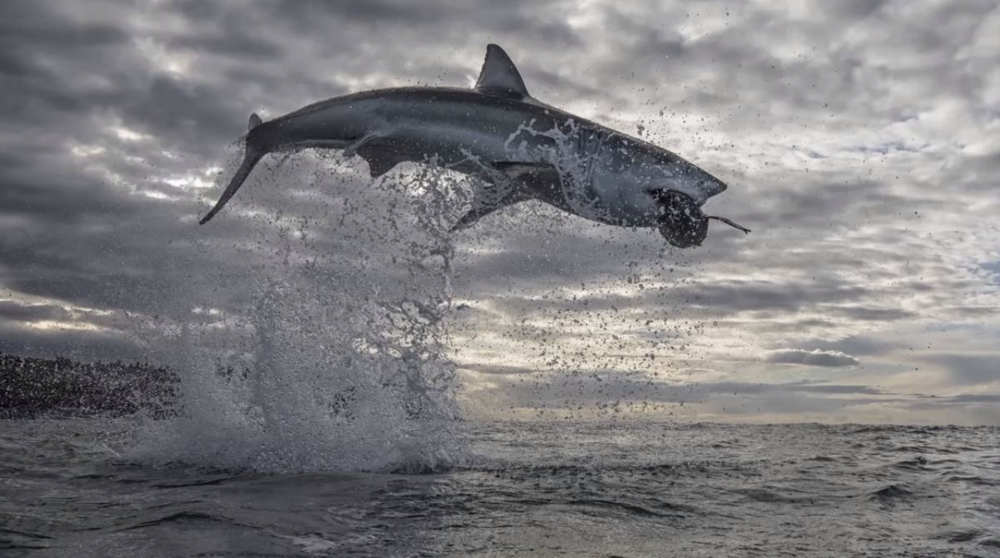

# **Shark Attacks - Pandas Project** 

### 

#### In this project I wanted to analyze the fatality of shark attacks over the last 2 centuries. 

#### I have created 3 hypotheses analyzing the fatality of shark attacks, first over time, then looking at the moment of the day, and finally looking at specific activities.
#
## **HYPOTHESES**:
#
#### 1. Over the years the % of shark attacks ending in fatality has decreased.
#### 2. The accidents happening at night have more chance of ending in fatality than in another time of the day.
#### 3. Surfing represents the activity with more fatal accidents.
#
## **PROCESS**:
#
#### First, I have had to clean the database which was full of NaN values (empty values), and with columns which were not going to help with the analysis of my hypotheses. 
#### Then, once the dataset was clean, I have been able to do my analysis to prove my 3 hypotheses, with the help of graphs. 
#### Finally, the conclusion of my hypotheses. I have proved that the first 2 of my hypotheses were true, while the last one not, as swimming represents the riskiest activity for shark attacks. 